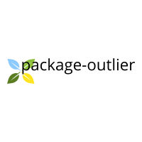

 


[](https://github.com/amit22666/package-outlier/issues)
[](https://github.com/amit22666/package-outlier/network)
[](https://github.com/amit22666/package-outlier/stargazers)
[](https://github.com/amit22666/package-outlier/blob/main/LICENSE)


# package outlier
 This is pypi package for outlier detection 
 
# Outlier detection package
A Python based outlier detection package.

## Install
Read the online Installation instructions.

This software depends on NumPy and Scipy, Python packages for scientific computing. You must have them installed prior to installing package-outlier.

Install the latest version of package-outlier

```$ pip install package-outlier```

This will display a message and download if the module is not already installed. It will then install package-outlier and all its dependencies. You may need root privileges to install setuptools.

## Outlier detection by zscore
Zscore is a common method to detect anomaly in 1-D.
For a given data point zscore is calculated by:\
zscore = data_point - mean / std_dev

The function take data and threshold value as required argument and returns data points that are outliers.

## Outlier detection by modified_zscore
Mean and standard deviation are themselves prone to outliers that's why we use median instead of mean and median absolute deviation instead of mean absolute deviation.\
For more info on median absolute deviation refer to https://en.wikipedia.org/wiki/Median_absolute_deviation.

## Parameters for package_outlier.zscore_and_anomaly_detection()
data : array like\
An array like object containing the sample data

threshold : int

flag : int, optional\
Default is 1. 1 for data points greater than threshold value and 0 for data points lesser than threshold value\

ddof: int, optional\
Degrees of freedom correction in the calculation of the standard deviation. Default is 0.

nan_policy: {"propagate", "raise", "omit"}, optional\
Defines how to handle when input contains nan. "propagate" returns nan, "raise" throws an error, "omit" performs the calculations ignoring nan values. Default is "propagate".

Returns:\
zscore: array_like
The z-scores, standardized by mean and standard deviation of input array.
outliers: array_like
These are points from data that are outliers.

## Parameters for package_outlier.modified_zscore_and_anomaly_detection()
data : array like\
An array like object containing the sample data

threshold : int

flag : int, optional\
Default is 1. 1 for data points greater than threshold value and 0 for data points lesser than threshold value

consistency_correction: float, optional\
Default is 1.4826. converts MAD to the standard deviation for a given distribution.

Returns:\
modified_zscore: array_like\
The modified-z-scores of input array.

mad: float\
median_absolute_deviation

outliers: array_like\
These are points from data that are outliers.

```
import package_outlier
import numpy as np

arr = [8,5,7,8,11,13,4,9,10,7,6]
arr = np.array(arr)

zscore, outliers = package_outlier.zscore_and_anomaly_detection(arr, 1)
print(zscore)
print(outliers)


modified_zscore, mad, outliers = package_outlier.modified_zscore_and_anomaly_detection(arr, 1)
print(modified_zscore)
print(mad)
print(outliers)

```
## Contribute
You've discovered a bug or something else you want to change - excellent!

You've worked out a way to fix it – even better!

You want to tell us about it – best of all!

Start at the contributing guide!


